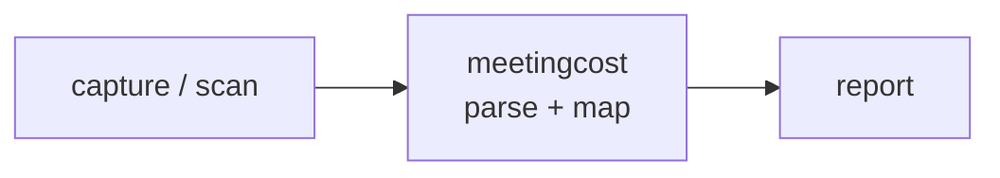

<a name="top"></a>
<div align="center">


# MEETINGCOST

### Compute the dollar cost of meetings from your calendar (.ics)


[](https://pypi.org/project/cognis-meetingcost/) [](https://github.com/cognis-digital/meetingcost/actions) [](LICENSE) [](https://github.com/cognis-digital)

*Business Operations — run the company without a SaaS bill for every function.*

</div>

```bash
pip install cognis-meetingcost
meetingcost scan .            # → prioritized findings in seconds
```

## Usage — step by step

1. **Install** the CLI (Python 3.9+):

   ```bash
   pip install cognis-meetingcost
   ```

2. **Cost a calendar.** Point `cost` at an `.ics` export (or `-` for stdin). Tune the loaded labor rate with `--salary` and `--overhead`, or set `--hourly-rate` directly:

   ```bash
   meetingcost cost team-week.ics --salary 120000 --overhead 1.4
   ```

3. **Get machine-readable output** for dashboards or further processing with `--format json`:

   ```bash
   meetingcost cost team-week.ics --format json | jq '.total_cost'
   ```

4. **Read the result.** The table prints a per-meeting cost breakdown plus `TOTAL COST`, total hours, and person-hours; JSON carries the same fields (`total_cost`, `meeting_count`, `total_person_hours`, per-meeting `cost`).

5. **Automate in CI / a pipe.** Stream a calendar straight in and extract the headline number:

   ```bash
   cat team-week.ics | meetingcost cost - --format json | jq '.total_cost'
   ```

## Contents

- [Why meetingcost?](#why) · [Features](#features) · [Quick start](#quick-start) · [Example](#example) · [Architecture](#architecture) · [AI stack](#ai-stack) · [How it compares](#how-it-compares) · [Integrations](#integrations) · [Install anywhere](#install-anywhere) · [Related](#related) · [Contributing](#contributing)

<a name="why"></a>
## Why meetingcost?

viral office utility

`meetingcost` is single-purpose, scriptable, and self-hostable: point it at a target, get prioritized results in the format your workflow already speaks (table · JSON · SARIF), gate CI on it, and let agents drive it over MCP.

<div align="right"><a href="#top">↑ back to top</a></div>

<a name="features"></a>
## Features

- ✅ Blended Hourly Rate
- ✅ Parse Ics
- ✅ Compute Costs
- ✅ Summarize
- ✅ Runs on Linux/macOS/Windows · Docker · devcontainer
- ✅ Ports in Python, JavaScript, Go, and Rust (`ports/`)

<div align="right"><a href="#top">↑ back to top</a></div>

<a name="quick-start"></a>
## Quick start

```bash
pip install cognis-meetingcost
meetingcost --version
meetingcost scan .                       # scan current project
meetingcost scan . --format json         # machine-readable
meetingcost scan . --fail-on high        # CI gate (non-zero exit)
```

<div align="right"><a href="#top">↑ back to top</a></div>

<a name="example"></a>
## Example

```text
$ meetingcost scan .
  [HIGH    ] MEE-001  example finding             (./src/app.py)
  [MEDIUM  ] MEE-002  another signal              (./config.yaml)

  2 findings · risk score 5 · 38ms
```

<div align="right"><a href="#top">↑ back to top</a></div>

<a name="architecture"></a>
## Architecture



<div align="right"><a href="#top">↑ back to top</a></div>

<a name="ai-stack"></a>
## Use it from any AI stack

`meetingcost` is interoperable with every popular way of using AI:

- **MCP server** — `meetingcost mcp` (Claude Desktop, Cursor, Cognis.Studio, [uncensored-fleet](https://github.com/cognis-digital/uncensored-fleet))
- **OpenAI-compatible / JSON** — pipe `meetingcost scan . --format json` into any agent or LLM
- **LangChain · CrewAI · AutoGen · LlamaIndex** — wrap the CLI/JSON as a tool in one line
- **CI / scripts** — exit codes + SARIF for non-AI pipelines

<div align="right"><a href="#top">↑ back to top</a></div>

<a name="how-it-compares"></a>
## How it compares

| | **Cognis meetingcost** | Shopify meeting cost calc |
|---|:---:|:---:|
| Self-hostable, no account | ✅ | varies |
| Single command, zero config | ✅ | ⚠️ |
| JSON + SARIF for CI | ✅ | varies |
| MCP-native (AI agents) | ✅ | ❌ |
| Polyglot ports (JS/Go/Rust) | ✅ | ❌ |
| Open license | ✅ COCL | varies |

*Built in the spirit of **Shopify meeting cost calc**, re-framed the Cognis way. Missing a credit? Open a PR.*

<div align="right"><a href="#top">↑ back to top</a></div>

<a name="integrations"></a>
## Integrations

Pipes into your stack: **SARIF** for code-scanning, **JSON** for anything, an **MCP server** (`meetingcost mcp`) for AI agents, and a webhook forwarder for SIEM/Slack/Jira. See [`docs/INTEGRATIONS.md`](docs/INTEGRATIONS.md).

<div align="right"><a href="#top">↑ back to top</a></div>

<a name="install-anywhere"></a>
## Install — every way, every platform

```bash
pip install "git+https://github.com/cognis-digital/meetingcost.git"    # pip (works today)
pipx install "git+https://github.com/cognis-digital/meetingcost.git"   # isolated CLI
uv tool install "git+https://github.com/cognis-digital/meetingcost.git" # uv
pip install cognis-meetingcost                                          # PyPI (when published)
docker run --rm ghcr.io/cognis-digital/meetingcost:latest --help        # Docker
brew install cognis-digital/tap/meetingcost                             # Homebrew tap
curl -fsSL https://raw.githubusercontent.com/cognis-digital/meetingcost/main/install.sh | sh
```

| Linux | macOS | Windows | Docker | Cloud |
|---|---|---|---|---|
| `scripts/setup-linux.sh` | `scripts/setup-macos.sh` | `scripts/setup-windows.ps1` | `docker run ghcr.io/cognis-digital/meetingcost` | [DEPLOY.md](docs/DEPLOY.md) (AWS/Azure/GCP/k8s) |

<div align="right"><a href="#top">↑ back to top</a></div>

<a name="related"></a>
## Related Cognis tools

- [`invoctl`](https://github.com/cognis-digital/invoctl) — CLI invoicing + payment-link generator with PDF and a local ledger
- [`churnlens`](https://github.com/cognis-digital/churnlens) — Self-hosted SaaS metrics — MRR, churn, LTV from Stripe or CSV
- [`leadforge`](https://github.com/cognis-digital/leadforge) — Lightweight MCP-native CRM pipeline with email sequences
- [`quotecraft`](https://github.com/cognis-digital/quotecraft) — Proposal / quote / SOW generator — YAML to branded PDF
- [`boardroom`](https://github.com/cognis-digital/boardroom) — Investor-update and KPI one-pager generator from your metrics
- [`seataudit`](https://github.com/cognis-digital/seataudit) — SaaS license, seat-usage and shadow-IT auditor

**Explore the suite →** [🗂️ all 170+ tools](https://github.com/cognis-digital/cognis-neural-suite) · [⭐ awesome-cognis](https://github.com/cognis-digital/awesome-cognis) · [🔗 cognis-sources](https://github.com/cognis-digital/cognis-sources) · [🤖 uncensored-fleet](https://github.com/cognis-digital/uncensored-fleet) · [🧠 engram](https://github.com/cognis-digital/engram)

<div align="right"><a href="#top">↑ back to top</a></div>

<a name="contributing"></a>
## Contributing

PRs, new rules, and demo scenarios are welcome under the collaboration-pull model — see [CONTRIBUTING.md](CONTRIBUTING.md) and [SECURITY.md](SECURITY.md).

> ### ⭐ If `meetingcost` saved you time, **star it** — it genuinely helps others find it.

## Interoperability

`{}` composes with the 300+ tool Cognis suite — JSON in/out and a shared
OpenAI-compatible `/v1` backbone. See **[INTEROP.md](INTEROP.md)** for the
suite map, composition patterns, and reference stacks.

## License

Source-available under the **Cognis Open Collaboration License (COCL) v1.0** — free for personal, internal-evaluation, research, and educational use; **commercial / production use requires a license** (licensing@cognis.digital). See [LICENSE](LICENSE).

---

<div align="center"><sub><b><a href="https://cognis.digital">Cognis Digital</a></b> · one of 170+ tools in the <a href="https://github.com/cognis-digital/cognis-neural-suite">Cognis Neural Suite</a> · <i>Making Tomorrow Better Today</i></sub></div>
